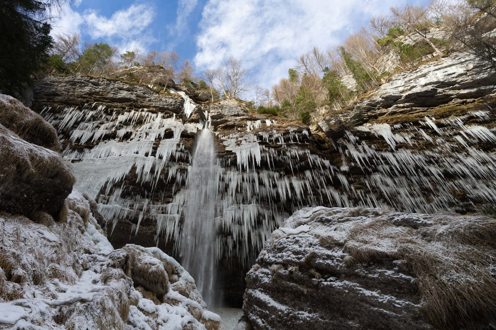

# Winter trip to Slovenia

As part of my graduation trip, I brought my parents along on a long trip in Europe. 
One of the countries that we visited is Slovenia.
As with many people, this small country in Europe entered my radar after Lake Bled became famous on Instagram.
My goals in Slovenia was to visit Lake Bled and to ski in the Julian Alps.

## Lake Bled
> Most interesting lake in Slovenia

## Lake Bohinj
> Quiet and relaxing

## Waterfall Pericnik
> Wonderful gem in winter

Due to the lack of activities in Lake Bohinj, I took a spontaneous trip with a rental car to Triglav National Park (since I am already in it).
The mini road trip brought us to one of the most beautiful spot in Slovenia. 

During winter, the road was covered in snow and all facilities near the waterfall was closed. 
There is free parking (in winter) along the road at the trail head and after a short 15 minute hike up a trail, we saw the waterfall.
The waterfall was partially frozen, with the sides full of icicles while the roar of the water continues unabated. 

PS: The trail is slippery near the waterfall and crampons are recommended as there are no handholds at some places.

## Ljubljana
> A compact capital friendly to pedestrians.

